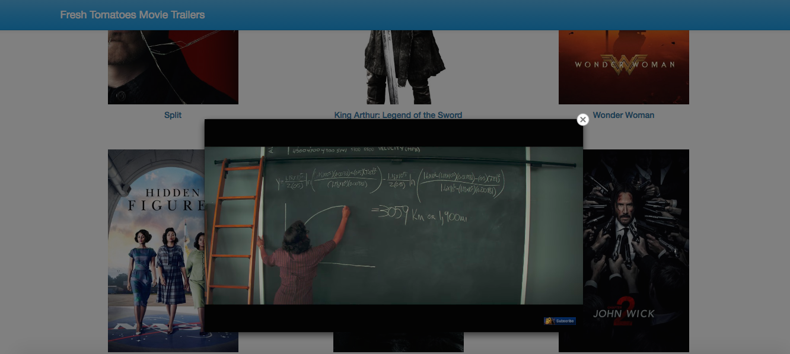

# Movie Trailer Website
The webpage displays the trailers of new movies in theatres.



# Prerequisites
1. [Python 2.7](https://www.python.org/download/releases/2.7/)
2. [Flask 0.12](http://flask.pocoo.org/docs/0.12/installation/)
3. [tmdbsimple 1.6.1](https://pypi.python.org/pypi/tmdbsimple)
4. Obtain an API key from [The Movie Database](https://www.themoviedb.org/settings/api). Sign up needed.

# Installation & Run
1. Download/Clone the zip file, extract it.
2. Open the command-line shell, and navigate to the project directory.
3. Edit config.txt file to add your obtained API key, without leading spaces or surrounding quotes.
    - API_KEY=\<your-api-key\>
4. Run:
```
python entertainment_center.py
```
5. Open your browser and visit the displayed address from running the previous command as shown below.


# Technical Details
- Movies are fetched using tmdbsimple API to get current movies in theatres
- The project follows the MVC pattern using Flask and AngularJS.
    1. Flask hosts REST APIs to retrieve the movies from "The Movies Database".
    2. AngularJS communicates with Flask server to get the movies retrieved from (i) and binds them with the view.
